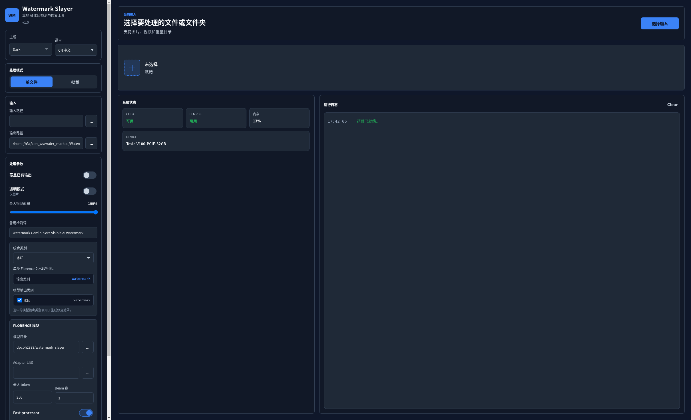
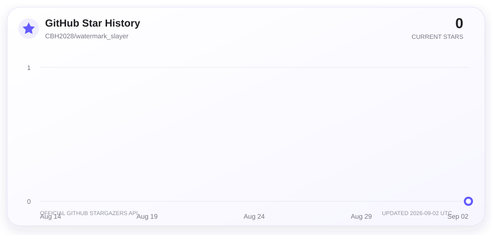

# Watermark Slayer

**AI-Powered Watermark Removal Tool using Florence-2 and LaMA Models**

[🇨🇳 中文](README_zh.md) | 🇬🇧 English

[](https://opensource.org/licenses/MIT)
[](https://huggingface.co/dpcbh2333/watermark_slayer)

---

## Overview

`Watermark Slayer` is a cutting-edge application that leverages AI models for precise watermark detection and seamless removal. Perfect for removing watermarks from AI-generated videos like Sora, Sora 2, Runway, and others.

It uses Florence-2 from Microsoft for watermark identification and LaMA for inpainting to fill in the removed regions naturally. The software features a modern GUI built with PyWebview for an accessible and intuitive experience.

## Screenshot



## Demo


https://github.com/user-attachments/assets/5b22f737-b0b9-4a82-92d5-0828e4b3a2ff


---

## Model Weights

The production Florence-2-large watermark detector is available at
**[dpcbh2333/watermark_slayer](https://huggingface.co/dpcbh2333/watermark_slayer)** on Hugging Face.
It is a standalone FP32 model with the selected LoRA adapter already merged, so PEFT and a separate
adapter are not required for inference. The Hugging Face repository is private; your Hugging Face
account must be granted access before downloading it.

### Download

```bash
python -m pip install --upgrade huggingface_hub
hf auth login
hf download dpcbh2333/watermark_slayer --local-dir ./models/watermark_slayer
```

The same download can be performed from Python after `hf auth login`:

```python
from huggingface_hub import snapshot_download

model_dir = snapshot_download(
    repo_id="dpcbh2333/watermark_slayer",
    local_dir="./models/watermark_slayer",
    token=True,
)
```

### Use with Watermark Slayer

In the GUI, set **Florence Model > Model folder** to the downloaded directory and leave
**Adapter folder** empty. For CLI processing, pass the model directory directly:

```bash
python watermark_slayer.py input.mp4 ./output \
  --florence-model-id ./models/watermark_slayer \
  --detection-task od \
  --detection-classes sd_wm,blur_wm
```

To load the complete model directly with Transformers:

```python
import torch
from transformers import AutoProcessor, Florence2ForConditionalGeneration

model_dir = "./models/watermark_slayer"
device = torch.device("cuda" if torch.cuda.is_available() else "cpu")
processor = AutoProcessor.from_pretrained(model_dir)
model = Florence2ForConditionalGeneration.from_pretrained(
    model_dir,
    torch_dtype=torch.float32,
).to(device).eval()
```

The main `model.safetensors` file is about 3.1 GB. Its SHA-256 checksum is
`929e09900fa893efd83654c381d72c2ebfdb7f7df86ca0f4b92421db7ec0a25a`.

---

## Features

- **Smart Detection** - AI-powered watermark detection using Florence-2
- **Seamless Removal** - LaMA inpainting for natural-looking results
- **Video Support** - Process videos with two-pass detection and audio preservation
- **AI Video Ready** - Remove watermarks from Sora, Sora 2, Runway, and other AI-generated videos
- **Batch Processing** - Handle entire folders at once
- **Preview Mode** - Preview detected watermarks before processing
- **Fade In/Out Handling** - Extend masks for watermarks that fade in/out
- **GPU Acceleration** - CUDA support for faster processing
- **Bilingual UI** - Clean Chinese and English interface
- **Professional Themes** - Focused dark and light themes

---

## Installation

### Windows

The setup script downloads a portable Python environment automatically - no system Python required.

```powershell
git clone https://github.com/CBH2028/watermark_slayer.git
cd watermark_slayer
.\setup.ps1
```

After setup, double-click `run.bat` to launch the app.

### Linux / macOS

Requires Python 3.10+ installed on your system.

```bash
git clone https://github.com/CBH2028/watermark_slayer.git
cd watermark_slayer
chmod +x setup.sh
./setup.sh
```

After setup, run `./run.sh` to launch the app.

### Optional: FFmpeg

Install FFmpeg to preserve audio when processing videos:
- **Windows**: Download from [ffmpeg.org](https://ffmpeg.org/download.html) and add to PATH
- **Linux**: `sudo apt install ffmpeg`
- **macOS**: `brew install ffmpeg`

---

## Usage

### GUI Mode

1. Run the app (`run.bat` on Windows, `./run.sh` on macOS/Linux)
2. Select your preferred language and theme from the top-right corner
3. Select your mode (Single File or Batch)
4. Set input and output paths
5. Configure settings as needed
6. Hit **Start Processing**

Your settings are automatically saved and restored on next launch.

### CLI Mode

```bash
# Basic usage
python watermark_slayer.py input.png output_folder/

# With options
python watermark_slayer.py ./images ./output --overwrite --max-bbox-percent=15 --force-format=PNG

# Process video with two-pass detection
python watermark_slayer.py video.mp4 ./output --detection-skip=3 --fade-in=0.5 --fade-out=0.5

# Preview mode (detect without processing)
python watermark_slayer.py input.png --preview
```

### CLI Options

| Option | Description |
|--------|-------------|
| `--overwrite` | Overwrite existing files |
| `--transparent` | Make watermark regions transparent (images only) |
| `--max-bbox-percent` | Max detection size as % of image (default: 100) |
| `--force-format` | Force output format (PNG, WEBP, JPG, MP4, AVI) |
| `--detection-prompt` | Custom detection prompt (default: "watermark") |
| `--detection-skip` | Detect every N frames for videos (1-10, default: 1) |
| `--fade-in` | Extend mask backwards by N seconds (for fade-in watermarks) |
| `--fade-out` | Extend mask forwards by N seconds (for fade-out watermarks) |
| `--preview` | Preview detected watermarks without processing |

---

## Video Processing

- **Supported formats:** MP4, AVI, MOV, MKV, FLV, WMV, WEBM
- **Audio preservation:** Requires FFmpeg installed
- **Two-pass mode:** Faster processing with `--detection-skip` > 1
- **Fade handling:** Use `--fade-in` / `--fade-out` for watermarks that appear/disappear gradually

---

## Tech Stack

- **Florence-2** - Microsoft's vision model for watermark detection
- **LaMA** - Large Mask Inpainting model
- **PyWebview** - Cross-platform webview wrapper
- **Vanilla JavaScript** - Lightweight local UI logic
- **PyTorch** - Deep learning backend

---

## Contributing

Contributions are welcome! Feel free to:

1. Fork the repository
2. Create a feature branch
3. Submit a pull request

---

## License

This project is licensed under the MIT License. See the [LICENSE](LICENSE) file for details.

---

## Star History

[](https://github.com/CBH2028/watermark_slayer/stargazers)

This repository-hosted chart is generated from GitHub's official Stargazers API, avoiding third-party chart outages. Click it for the live stargazer list; maintainers can refresh it with `python tools/update_star_history.py`.
